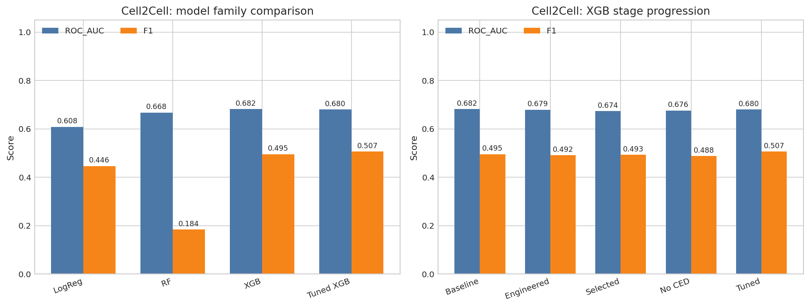
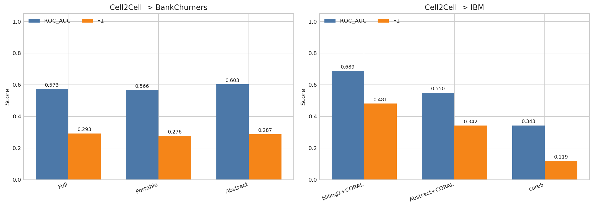
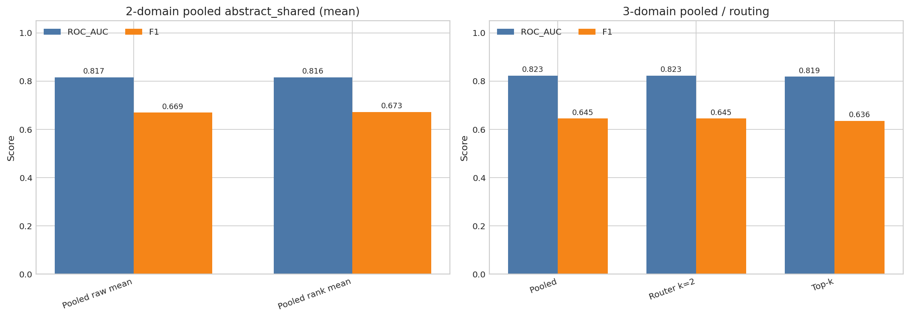
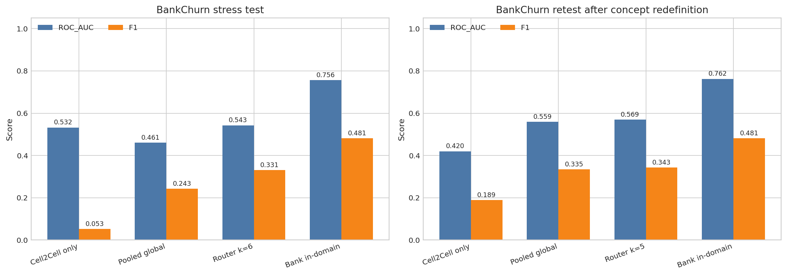

# Experiment Dashboard

이 문서는 지금까지의 대표 실험을 보기 쉽게 정리한 대시보드다. 모든 파라미터 탐색을 전부 나열한 것은 아니고, 흐름을 설명하는 데 중요한 대표 결과만 골랐다.

## 1. 한눈에 보는 대표 결과
| phase | best setup | roc_auc | f1 | message |
| --- | --- | --- | --- | --- |
| Cell2Cell internal | Tuned XGBoost | 0.6805 | 0.5070 | 내부 기준선은 유지 기간/사용량 중심의 tuned XGBoost가 가장 안정적. |
| Cell2Cell -> BankChurners | abstract_shared raw | 0.6031 | 0.2869 | 추상 개념층이 portable schema보다 전이를 더 잘 살렸다. |
| Cell2Cell -> IBM | billing2 + CORAL | 0.6885 | 0.4813 | IBM에는 billing 중심 축이 아직 가장 강했다. |
| BankChurn stress v1 | Router k=6 | 0.5429 | 0.3308 | 새 은행 도메인은 꽤 거칠어서 routing만으로도 개선이 제한적이었다. |
| BankChurn retest v2 | Router k=5 | 0.5691 | 0.3426 | BankChurn 개념 재정의 후 pooled global과 router가 모두 개선됐다. |
| 3-domain pooled | Router k=2 | 0.8232 | 0.6448 | 도메인-aware pooled training이 전체 평균 성능을 가장 안정적으로 유지했다. |

## 2. Cell2Cell 내부 성능 진화
| model | roc_auc | accuracy | precision | recall | f1 |
| --- | --- | --- | --- | --- | --- |
| Logistic Regression | 0.6084 | 0.5848 | 0.3625 | 0.5809 | 0.4464 |
| Random Forest | 0.6676 | 0.7200 | 0.5737 | 0.1098 | 0.1843 |
| XGBoost | 0.6820 | 0.6309 | 0.4087 | 0.6292 | 0.4955 |
| Engineered XGB | 0.6794 | 0.6305 | 0.4073 | 0.6203 | 0.4917 |
| Selected XGB | 0.6741 | 0.6248 | 0.4037 | 0.6332 | 0.4931 |
| No CurrentEquipmentDays | 0.6763 | 0.6347 | 0.4093 | 0.6044 | 0.4881 |
| Tuned XGB | 0.6805 | 0.5897 | 0.3878 | 0.7322 | 0.5070 |

## 3. 외부 전이 요약
| task | setup | roc_auc | f1 |
| --- | --- | --- | --- |
| Cell2Cell -> BankChurners | Full model | 0.5732 | 0.2926 |
| Cell2Cell -> BankChurners | Portable model | 0.5663 | 0.2764 |
| Cell2Cell -> BankChurners | abstract_shared raw | 0.6031 | 0.2869 |
| Cell2Cell -> IBM | billing2 + CORAL | 0.6885 | 0.4813 |
| Cell2Cell -> IBM | abstract_shared + CORAL | 0.5496 | 0.3421 |
| Cell2Cell -> IBM | core5 | 0.3425 | 0.1187 |

## 4. 다도메인 공동학습
| setting | setup | roc_auc | f1 |
| --- | --- | --- | --- |
| 2-domain pooled | Pooled raw mean | 0.8165 | 0.6695 |
| 2-domain pooled | Pooled rank mean | 0.8164 | 0.6727 |
| 3-domain pooled | Router k=2 | 0.8232 | 0.6448 |
| 3-domain pooled | Top-k gating | 0.8186 | 0.6359 |

2-domain pooled는 두 홀드아웃의 평균값으로, 3-domain pooled는 대표 mean AUC/F1를 그대로 적었다.

## 5. BankChurn 스트레스 테스트
| setting | setup | roc_auc | f1 |
| --- | --- | --- | --- |
| Original stress | Cell2Cell only | 0.5319 | 0.0526 |
| Original stress | Pooled global | 0.4608 | 0.2427 |
| Original stress | Router k=6 | 0.5429 | 0.3308 |
| Original stress | Bank in-domain | 0.7564 | 0.4809 |
| Retest v2 | Cell2Cell only | 0.4198 | 0.1889 |
| Retest v2 | Pooled global | 0.5588 | 0.3346 |
| Retest v2 | Router k=5 | 0.5691 | 0.3426 |
| Retest v2 | Bank in-domain | 0.7620 | 0.4809 |

## 읽는 법
- AUC는 순위 분리력, F1은 실제 0/1 판정 품질을 본다.
- 외부 전이에서는 AUC가 0.5를 넘는지, 그리고 threshold를 다시 잡았을 때 F1이 얼마나 회복되는지가 중요하다.
- BankChurn은 unseen target이라, pooled global과 router가 올라가도 in-domain보다 낮다면 아직 정렬이 덜 된 것이다.